<div align="center">

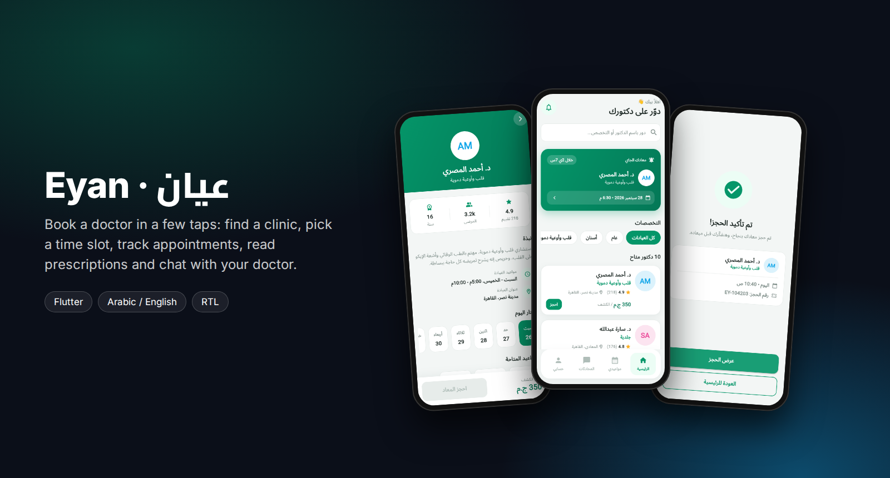

<br/>

[](https://flutter.dev)
[](https://dart.dev)
[](#features)
[](#status-and-roadmap)

**Book a doctor in a few taps.**
Find a clinic by doctor or specialty, pick a free time slot, keep track of your appointments,
read your prescriptions and message your doctor.

عيان — تطبيق حجز مواعيد الأطباء، بواجهة عربية وإنجليزية كاملة.

</div>

---

## Screenshots

<table>
  <tr>
    <td align="center">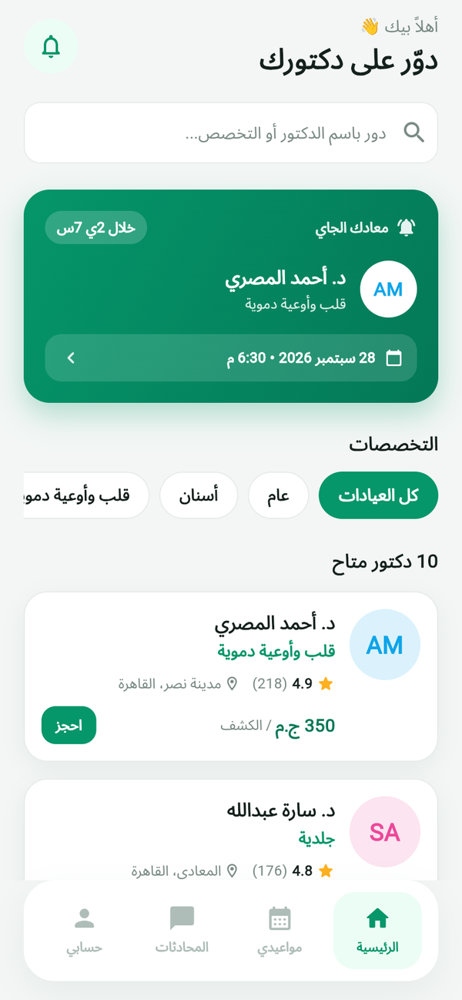<br/><sub><b>Home</b><br/>Search, specialties, next visit</sub></td>
    <td align="center">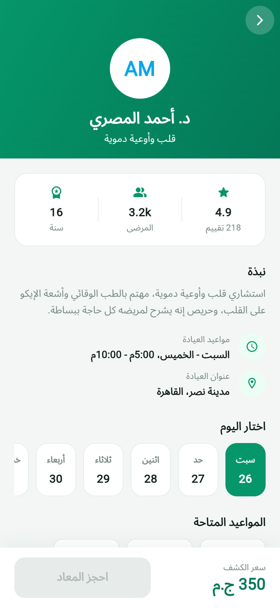<br/><sub><b>Doctor profile</b><br/>Rating, patients, experience</sub></td>
    <td align="center">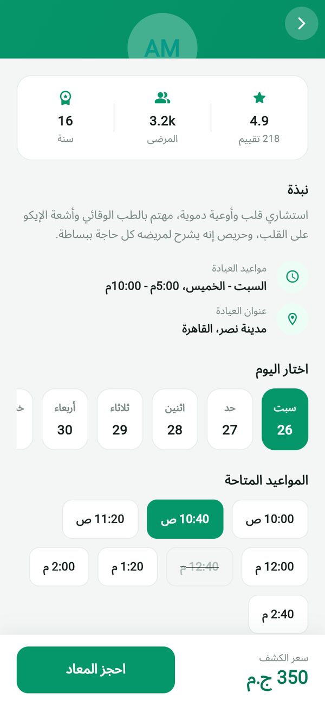<br/><sub><b>Pick a slot</b><br/>Day strip and free times</sub></td>
    <td align="center">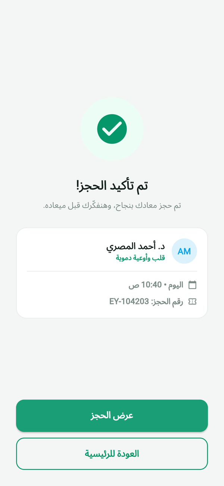<br/><sub><b>Booked</b><br/>Confirmation and booking number</sub></td>
  </tr>
  <tr>
    <td align="center">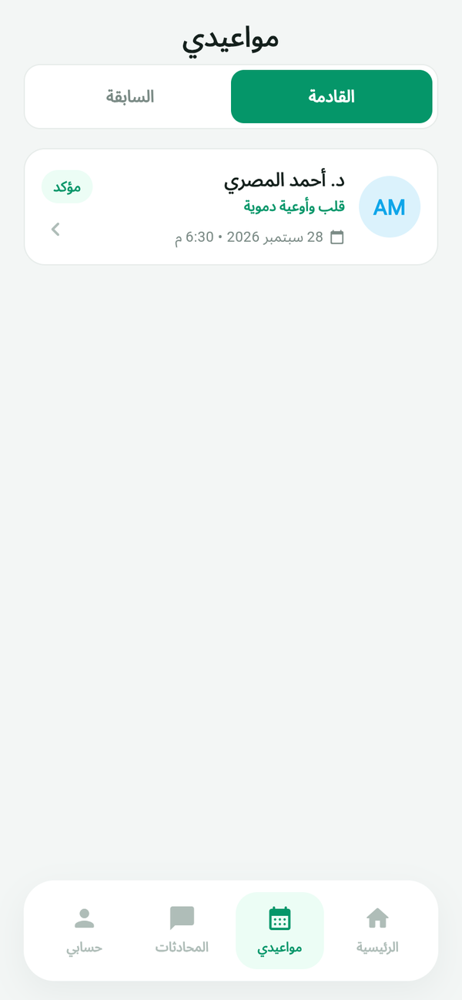<br/><sub><b>My appointments</b><br/>Upcoming and past</sub></td>
    <td align="center">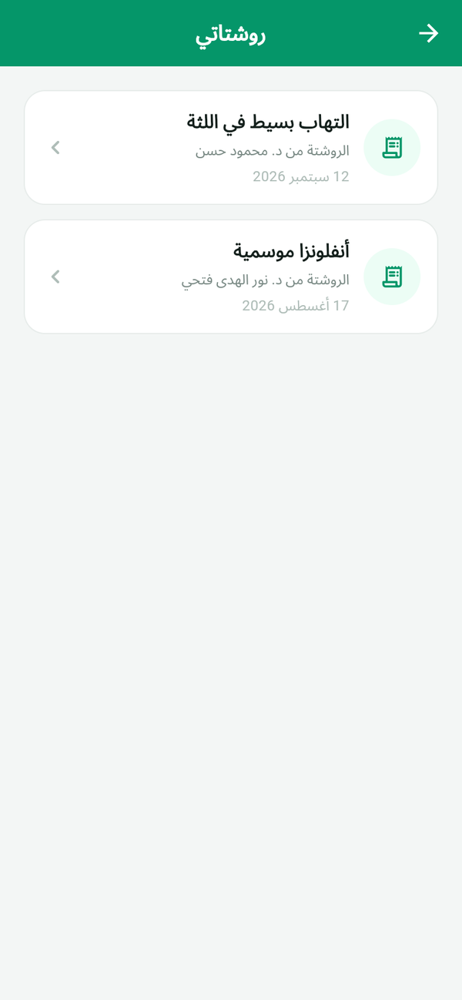<br/><sub><b>Prescriptions</b><br/>Every visit's prescription</sub></td>
    <td align="center">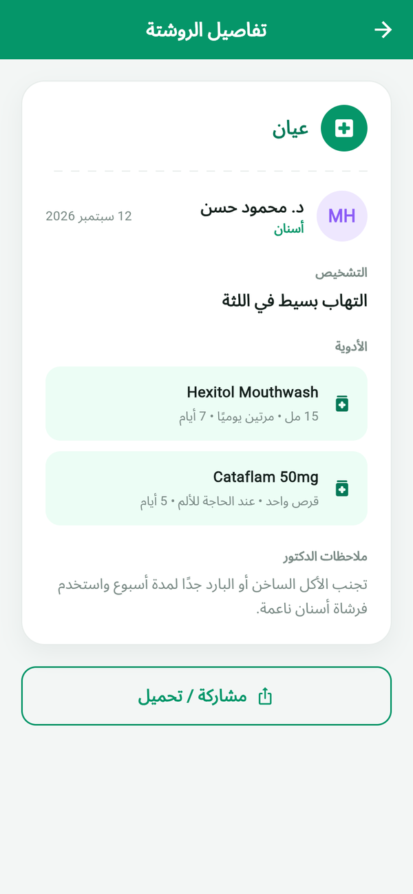<br/><sub><b>Prescription</b><br/>Diagnosis, medicines, dosage, notes</sub></td>
    <td align="center">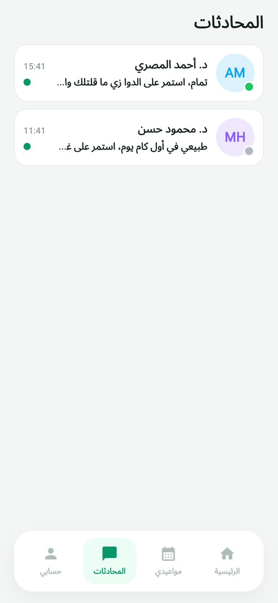<br/><sub><b>Conversations</b><br/>Online status and last message</sub></td>
  </tr>
  <tr>
    <td align="center">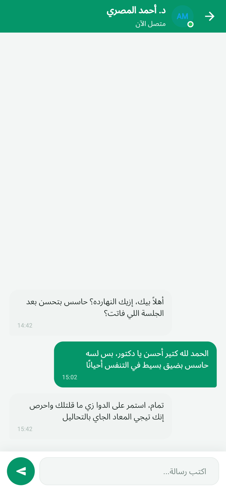<br/><sub><b>Chat</b><br/>Messaging with the doctor</sub></td>
    <td align="center">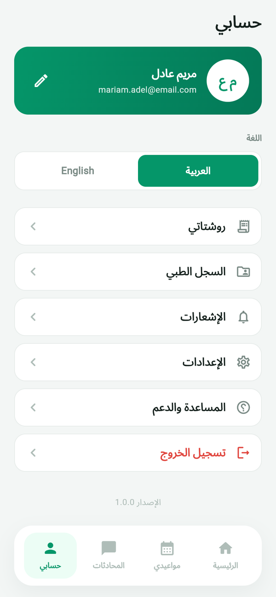<br/><sub><b>Profile</b><br/>Language, records, settings</sub></td>
    <td align="center">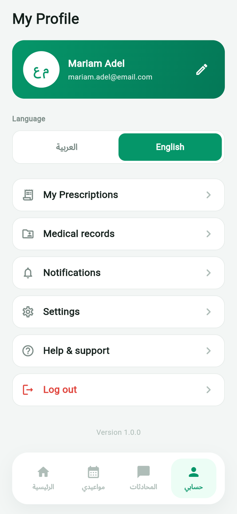<br/><sub><b>English</b><br/>Switches to LTR instantly</sub></td>
    <td align="center">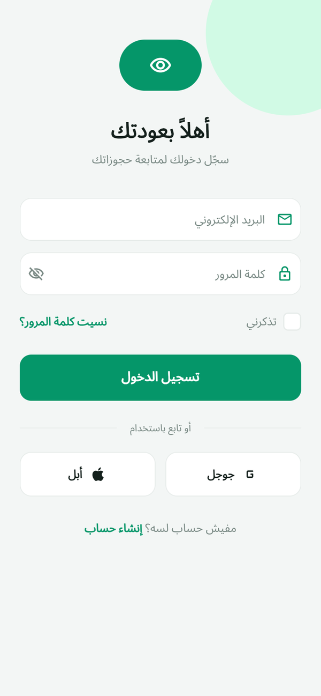<br/><sub><b>Sign in</b><br/>Email, Google or Apple</sub></td>
  </tr>
</table>

## Features

- **Find a doctor:** search by doctor name or specialty, filter by specialty, see rating, number of reviews, area and consultation fee
- **Upcoming visit card** on the home screen with a live countdown
- **Doctor profile:** bio, working hours, clinic address, experience, patients and rating
- **Booking flow:** choose a day, choose a free time slot (booked slots are crossed out), review the summary and confirm
- **Appointments:** upcoming and past tabs, status badges, details and cancellation
- **Prescriptions:** a list per visit and a detail view with diagnosis, medicines, dosage and duration, the doctor's notes, and share / download
- **Chat:** conversation list with online status and a messaging screen
- **Profile:** account card, language switch, medical records, notifications, settings, help and logout
- **Bilingual:** full Arabic and English UI with automatic RTL / LTR switching at runtime

## Tech stack

| Area | Choice |
|:--|:--|
| Framework | Flutter, Dart |
| Localization | `flutter_localizations` with a lightweight string table and a `LocaleController` |
| Design | custom theme (brand color `#059669`), shared widgets for buttons, fields, avatars, status pills and empty states |
| Data | in-memory data layer (`lib/data/app_data.dart`) behind typed models |

The app has no third-party packages beyond the Flutter SDK.

```
lib/
  core/            theme, localization, shared widgets, date utilities
  data/            data store (AppData)
  models/          Doctor, Appointment, Prescription, ChatThread, ...
  features/
    auth/          splash, login, register
    home/          clinic and doctor listing
    doctor/        doctor profile and booking flow
    appointments/  appointment list and details
    prescriptions/ prescription list and details
    chat/          conversation list and chat screen
    profile/       account and settings
    root/          bottom navigation shell
```

## Getting started

```bash
flutter pub get
flutter run              # Android / iOS
flutter run -d chrome    # web preview
```

Any email and a password of six characters or more will sign you in.

## Status and roadmap

The full patient experience is built and navigable. Data currently comes from the in-app data
layer, and the models are ready to be backed by a real service.

- [ ] Supabase backend for clinics, doctors, time slots and bookings
- [ ] Real authentication in place of the local sign-in flow
- [ ] Push notifications for appointment reminders

## Author

**Osama Yosef** · Flutter developer, Cairo

[](https://github.com/osama-Yosef)
[](https://www.linkedin.com/in/osama-yosef-819268319)
[](https://upwork.com/freelancers/~014ebd205ef38ca04c)
[](mailto:osamayosef038@gmail.com)
